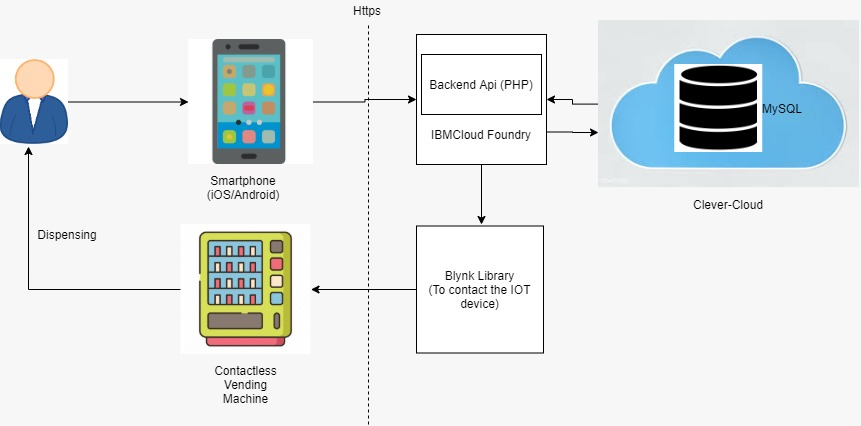

# Innovators - Contactless Food Vending Machine
## Contents

1. [Short description](#short-description)
1. [Demo video](#demo-video)
1. [The architecture](#the-architecture)
1. [Long description](#long-description)
1. [Project roadmap](#project-roadmap)
1. [Getting started](#getting-started)

## Short description

### What's the problem?

The business problem that we are taking up is that in the current situation, when social distancing is a must and people are out of work and facing challenges related to procurement of essential commodities, the government has come up with variety of schemes to provide necessary food items to the needy people in the society. But currently there is no  way to  ensure that the benefits reach the people by avoiding direct contact and also migrant workers does not have facility to avail the government scheme in a different state. 

The problem stated above is a genuine one where we have seen many reports in the news where the people are actually not able to get the benefits even though the government has announced the scheme and is working on that. 

### How can technology help?

The solution we suggest includes a vending machine and a mobile application that would help us identify the individual and the benefits he is eligible for and then we can send an instruction to the vending machine to vend that much quantity of food grains. This way we can have a digital database to track the individuals who had benefitted directly and also we can remove the middle man benefitting by hoarding of grains and providing wrong measurements of food grains. 
 
 ## Demo Video
 

## Long description

The team is proposing a Contactless Staple Food Vending machine which would provide people the basic essential commodities like Rice, Dal, Sugar ,etc. in a contactless manner. This is an idea where we are extending the Indian Government scheme of providing the peoples with the basic commodities mentioned where they do not need to come in direct contact with any other person or the machine. The peoples who have a smartphone will be able to use a mobile application to scan the QR code on the machine will be sent to the server and from the server we would be able to identify the allotted quantities to the specified individuals which can be vended out of the machine. This application will also have a donation feature for people who wants to donate these food items across the country, they could simply do so by using this application. This application will ensure the donation to reach the right people who are in need. 

We are constantly listening in the news that people are facing difficulty in arranging food for them, especially in India where people are walking miles to reach their hometown. So we identified this and  IBM also have given us a chance to explore our skills and find a solution for this problem. 
We just thought of making something to solve this issue and we started adding people, debating, brain storming then we came up with this solution. 

## Project roadmap
### Architecture

 
## Getting started

### Android app code
https://github.com/Infy-Innovators/food-atm-android

### API Code

https://github.com/Infy-Innovators/foot_atm_api

